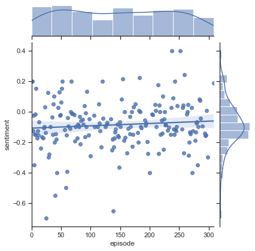

# Sentiment Analysis of Squidward Tentacles :squid:

## Summary
Growing up I used to love watching SpongeBob on TV. The contrast between the different characters in the Bikini Bottom makes for an entertaining show. One running theme throughout the show is the characterization of a grumpy Squidward Tentacles. Squidward enjoys peace, quiet, and the finer things in life, and is clearly bothered by Spongebob's constant noise-making and fooling around. But just how grumpy is Mr. Squidward? And how does his negativity evolve throughout the duration of the show? I had a theory that Squidward actually 'cheers up' as time goes on, and I think this may be attributed to a change in corporate strategy. It would make sense if it were the case that the creators of Spongebob cleaned up Squidward's act to make the episodes more appealing as a children's show. Using data science, I put this theory to the test and came up with some interesting results!

## The Process (Summarized) :recycle:

## Technologies Used :microscope:
- Python: pandas, numpy, matplotlib/seaborn
- Web scraping, data processing, machine learning, data visualization
- Google Cloud Natural Language API

## The Results :heavy_check_mark:
I compiled a list of everything Squidward said in each episode of the TV series. I ran the data through a sentiment analysis model and computed an average score for each episode. There are about 300 total episodes, and because they are chronological, we are looking at a time series plot. Also included in the figure are the 10-day and 20-day simple moving averages.

If we take a look at the distribution through the lens of a linear regression model, we can see that there is a very slight upward trend in the data.

Now, is this upward trend significant, or is it likely due to some random noise? Let's perform an Augmented Dickey-Fuller test on this time series to find out.

    from statsmodels.tsa.stattools import adfuller
    result = adfuller(X)
    print('ADF Statistic: %f' % result[0])
    print('p-value: %f' % result[1])
    print('Critical Values: ')
    for key, value in result[4].items():
        print('\t%s: %.3f' % (key, value))
        
ADF Statistic: -12.439276
p-value: 0.000000
Critical Values: 
	1%: -3.466
	5%: -2.877
	10%: -2.575

## What I Learned :books:

I was able to continue practicing my data processing skills and become more familiar with various text preprocessing techniques for NLP machine learning models. I also had the opportunity to strengthen my understanding of time series analysis, where I was able to apply some of the techniques I learned in class.

## Future Implementations :rocket:

In the future, I hope to add sentiment analysis models for more characters so that we have a better point of comparison. I also am planning on designing and creating a chatbot that will have the personality of Squidward, by training the model using Squidward's dialogue.
